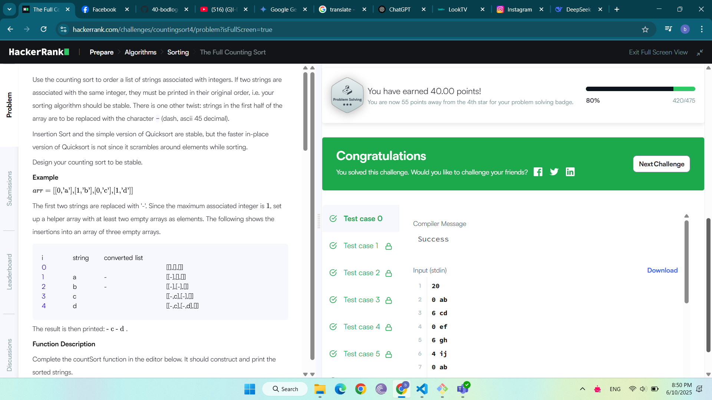

The Full Counting Sort
бодлогын өгүүлбэр
Эхний хагас оролтын мөрүүдийг "-" тэмдэгтээр солих тоололт эрэмбэлэлт хийх.

Оролт
Эхний мөр: n (мөрүүдийн тоо, 1 ≤ n ≤ 10^6)

Дараагийн n мөр: x (0 ≤ x < 100) болон s (тэмдэгт мөр) хос. Эхний n/2 мөрүүдийн s-г "-" болгон солих

Гаралт
Эрэмбэлэгдсэн дарааллаар x-ийн дагуу s-г нэг мөрөнд зайгаар тусгаарлан хэвлэ

Жишээ
Оролт:

20
0 ab
6 cd
0 ef
6 gh
4 ij
0 ab
6 cd
0 ef
6 gh
0 ij
4 that
3 be
0 to
1 be
5 question
1 or
2 not
4 is
2 to
4 the
Гаралт:

- - - - - to be or not to be - that is the question - - - -
