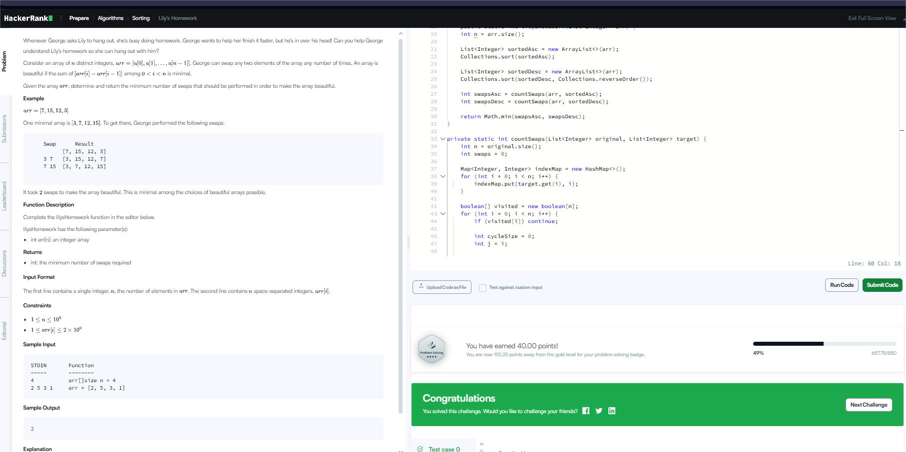

LilysHomework
Даалгаврын товч танилцуулга Өгөгдсөн массивыг аль болох бага солилцоо ашиглан өсөх дарааллаар эсвэл буурах дарааллаар эрэмбэлэх шаардлагатай.

Эцсийн зорилго — хамгийн бага солилцооны тоог олох.

Шийдлийн санаа Массиваа өсөх дарааллаар эрэмбэлж, хамгийн бага солилцооны тоог олно.

Мөн буурах дарааллаар эрэмбэлж, мөн хамгийн бага солилцооны тоог олно.

Энэ хоёрын аль бага нь бидний хариу.

Гол санаа — хэрхэн солилцоог тооцох вэ? Солилцооны тоог олно гэдэг нь тухайн массивыг хүссэн эрэмбэлэлтийн дагуу эрэмбэлэхэд шаардлагатай swap-ийн хамгийн бага тоо.

Энэ нь циклийн хувьд ойлгогдоно — тооны байрлал болон хүссэн байрлал хоорондын cycles-г олж, swap-ийн тоог тооцох. Lily’s Homework дасгалын код тайлбар Төсөөлөл: Танд массив өгөгдсөн. Түүнийг өсөх эсвэл буурах дарааллаар эрэмбэлэхэд хамгийн бага swap хийх шаардлагатай.

Эцсийн зорилго: хамгийн бага солилцооны тоог олж буцаах.

lilysHomework функц int n = arr.size(); Массивын уртыг хадгалж авна.

List sortedAsc = new ArrayList<>(arr); Collections.sort(sortedAsc); Өгөгдсөн массивын өсөх дараалалтай хувилбарыг бүтээж авна.

List sortedDesc = new ArrayList<>(arr); Collections.sort(sortedDesc, Collections.reverseOrder()); Мөн буурах дараалалтай хувилбарыг бүтээж авна.

int swapsAsc = countSwaps(arr, sortedAsc); int swapsDesc = countSwaps(arr, sortedDesc); Анхны массивыг өсөх дараалалтай ижил болгоход хичнээн swap хэрэгтэйг олно.

Мөн буурах дараалалтай ижил болгоход хэрэгтэй swap-ыг олно.

return Math.min(swapsAsc, swapsDesc); Эдгээрээс бага swap-ыг буцаана.

countSwaps функц Энэ функц swap тоог cycle detection ашиглан тоолдог. Map<Integer, Integer> indexMap = new HashMap<>(); for (int i = 0; i < n; i++) { indexMap.put(target.get(i), i); } Эрэмбэлсэн массивын элементийн утгаас индекс рүү mapping хийж хадгална.

Жишээ: элемент 5 нь шинэ массивын 3-р индекс дээр байгаа гэх мэт.

boolean[] visited = new boolean[n]; for (int i = 0; i < n; i++) { if (visited[i]) continue; Массивын элементүүдийг эргүүлж cycle-д орсон эсэхийг шалгана.

int cycleSize = 0; int j = i;

while (!visited[j]) { visited[j] = true; j = indexMap.get(original.get(j)); cycleSize++; } Cycle олох хэсэг:

Эхлээд индекс i-ээс эхлэн, тухайн байрлалд байгаа элементийн шинэ байрлалыг indexMap-аас авч дараагийн индекс рүү шилжинэ.

Цикл үүсэх хүртэл үргэлжлүүлнэ.

Cycle-ийн уртыг cycleSize-д тоолно.

if (cycleSize > 1) { swaps += cycleSize - 1; } Цикл бүрийн swap тоог тооцоолно.

Cycle-ийн урт n байвал түүнийг хэвийн болгоход n-1 удаа swap хийгддэг.

Яагаад ингэж тоолох вэ? Массивыг эрэмбэлэхэд ямар элемент хаана байгаагаа мэдэх шаардлагатай.

Cycle-г олох нь солилцооны хамгийн бага тоог гаргах шалгарсан арга юм.

Cycle бүрийг салангид авч үзээд swap-уудыг нийлүүлнэ.
